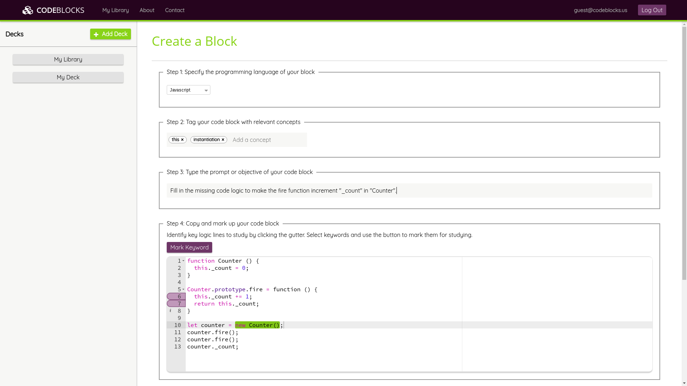
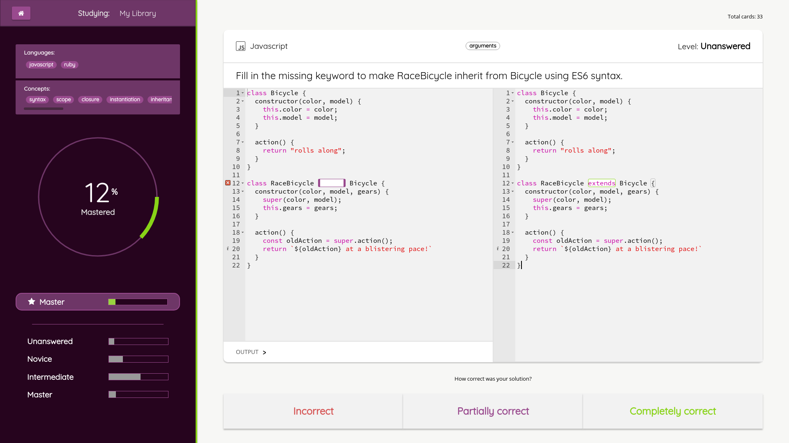
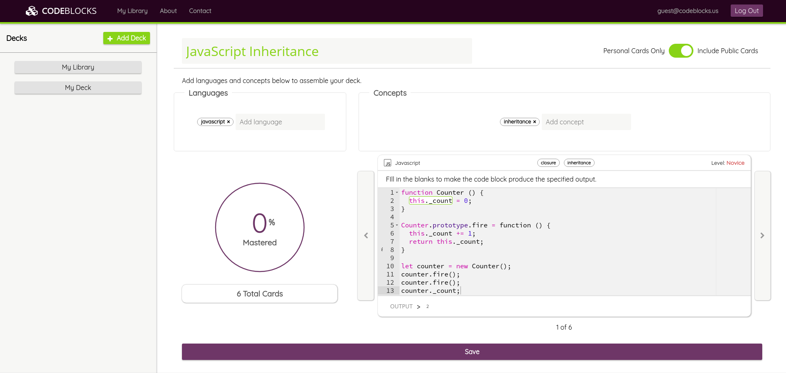

# CodeBlocks
[Live](https://code-blocks.herokuapp.com/)

CodeBlocks is a web application that enables users to transcribe code blocks from literature into interactive flash cards. It was built using Ruby on Rails, React/Redux, and PostgreSQL.

## Technologies
Rails is a back-end MVC web framework that was used for data fetching and storage with a connection to a PostGreSQL database. Rails potential to get up and running as a simple RESTful API was part of its appeal as a back end. The front end application was written using javascript's React library for reuseable, modular code. It was used in conjunction with the Redux framework to add in the benefits of a unidirectional dataflow which made the application easier to debug.

## Features & Implementation
### Transcribing Personalized Code Blocks

In order to develop a deep understanding of programming concepts, it is crucial to study and review code samples. CodeBlocks allows users to copy code samples into a web-based code editor and indicate what output, keywords, or entire lines of logic are critical to understanding the concept at hand.

Specifying the CodeBlock's output, keywords, and key lines result in varying levels of difficulty when studying. When a user first sees the CodeBlock while studying, they will be prompted to fill in the output. The next time the block is encountered, the user will have to fill in the missing keywords. The final difficulty level involves filling in entire missing lines of logic. A block does not need to have all 3 difficulty levels, which allows for flexibility when creating blocks.

### Interactive Studying and Persistent Statistics

Users can choose to study an individual deck or their entire library of CodeBlocks at any given time. When studying, the user is prompted to fill in the solution to the current block, and then has the option of comparing their solution to the original code sample. By indicating whether their answer was correct, the user can advance up or down the difficulty levels for that block.

While studying, the application naturally progresses through the various difficulty levels by consistently providing a random card from the lowest difficulty level. The user's progress for each CodeBlock is tracked and persisted between sessions to allow for a personalized study experience.

### Deck Creation and Public CodeBlocks

Users may create decks to focus their studyig on particular concepts and languages. By specifying a combination of languages and concepts, a user can quickly and easily build collections of cards to study. The deck view UI also tracks the user's mastery for a given deck, and tracks the code blocks that are included in that deck.

When creating CodeBlocks, users have the option to share them by making them public. When creating decks, users can study public CodeBlocks by selecting that option when creating the deck. Including public cards in your deck allows users to jump into studying new concepts quickly and easily. Decks with public CodeBlocks will automatically be updated when other users create new CodeBlocks with the matching criteria, ensuring that new challenges will consistently be available to the user.

## Future Improvements
### Fine tuned control of deck blocks
Allowing the user to manually add or remove CodeBlocks from their decks would provide the user with a more customizable experience.
### Upvoting system for CodeBlocks
By keeping track of the number of upvotes for public CodeBlocks, users would be able to filter their decks to ensure only high-quality content. This would provide for a smoother, more professional study experience when studying public decks.
### Executable CodeBlocks
The current state of the application does not run any of the code that users provide. By implementing the ability to execute code, the user would not have to indicate whether their answer was correct, which would reduce a possible source of user confusion and provide a more fluid and meaningful coding experience.
